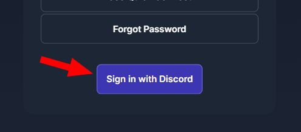

# Jellyfin Discord Authentication Plugin

This plugin lets users sign in to Jellyfin using their Discord account and syncs access based on Discord server roles.

Plugin repository manifest URL:

- https://trowbridge.tech/jellyfin/discord/manifest.json

## Requirements

- Jellyfin 10.11.x
- A Discord server you manage
- A Discord application with a bot
- A stable Jellyfin URL reachable by users (HTTPS strongly recommended)

## 1. Add the Plugin Repository in Jellyfin

1. Open Jellyfin Admin Dashboard.
2. Go to `Plugins` -> `Manage Repositories`.
3. Click `+ New Repository` to add a repository.
4. Use:
   - Name: `Discord Auth` (or any name you prefer)
   - URL: `https://trowbridge.tech/jellyfin/discord/manifest.json`
5. Click `Add`
6. Refresh the page and go back to `Plugins` and install `Discord-Auth`.
7. Restart Jellyfin.

## 2. Create and Configure the Discord App/Bot

1. Open the Discord Developer Portal: https://discord.com/developers/applications
2. Create a new application and give it a name.
3. In the `OAuth2` tab -> `Client information`, copy this info and save for later:
   - `Client ID`
   - `Client Secret`
4. In the `OAuth2` tab -> `Redirects`, add this exact callback URL:
   - `https://YOUR_JELLYFIN_HOST/DiscordAuth/Callback`
   - Example: `https://media.example.com/DiscordAuth/Callback`
5. In the `Bot` tab, reset and copy the `Bot Token` and save for later.
6. In `Bot` -> `Privileged Gateway Intents`, enable:
   - `Server Members Intent`
7. Invite the bot to your Discord server.
   - In `OAuth2` -> `URL Generator`:
     - Scopes: `bot`
     - Bot permissions (recommended minimum):
       - `View Channels`
       - `Manage Roles` (required for default role assignment)
   - Open the generated URL and select your server.
   - After invite, in Discord server settings, keep the bot role above any role it needs to assign.

Notes:
- The plugin uses OAuth scopes `identify` and `email` for sign-in.
- The redirect URI must exactly match the host/protocol users use to access Jellyfin.

## 3. Collect Discord IDs Needed by the Plugin

You will need your Discord server ID and role IDs.

1. In Discord, enable Developer Mode (`User Settings` -> `Advanced` -> `Developer Mode`).
2. Right-click your server -> `Copy Server ID`.

## 4. Configure the Plugin in Jellyfin

1. Open Jellyfin Admin Dashboard -> `Plugins` -> `Discord-Auth` -> `Settings`.
3. Fill in:
   - `Client ID`: from Discord app OAuth2 settings
   - `Client Secret`: from Discord app OAuth2 settings
   - `Server ID`: your Discord server ID
   - `Bot Token`: from Discord bot page
4. Optional role-based settings:
   - `Admin Role`: users with this Discord role become Jellyfin admins
   - `Library Mapping`: map each Jellyfin library to a Discord role
   - `Use default assign`: when checked for a library mapping, that Discord role is automatically assigned to users who join your server
5. Save the configuration.

The plugin restarts its Discord client when configuration changes are saved.

## 5. Configure the Sign in with Discord Button 

1. Open Jellyfin Admin Dashboard -> `Branding`.
2. Add the following HTML to the `Login disclaimer`

``` html
<form action="/DiscordAuth/Login">
  <button class="raised block emby-button button-submit">
    Sign in with Discord
  </button>
</form>
```
3. Save the configuration.



## 6. Test Login Flow

1. Open this URL in a browser:
   - `https://YOUR_JELLYFIN_HOST`
2. Click the `Sign in with Discord` button.
3. You should be redirected to Discord to authorize the login then redirected back Jellyfin and you should be logged into Jellyfin.

Behavior during login:

- If the Discord user is not in the configured server, login is denied.
- If the user only has `@everyone` (no other roles), login is denied.
- New Jellyfin users are auto-created.
- Existing linked users are updated and role/library access is synchronized.

## 7. How Role Sync Works

- On Discord member role changes, Jellyfin permissions are updated.
- If `Admin Role` matches, Jellyfin admin permissions are enabled.
- Library access is granted from configured role mappings.
- If no explicit mappings are set, fallback behavior tries matching Discord role names to Jellyfin library names.
- If a user leaves the Discord server, their Jellyfin account is disabled.
- If they rejoin, their Jellyfin account is re-enabled.

## Troubleshooting

- Login fails after Discord authorize:
  - Confirm callback URL in Discord exactly matches `https://YOUR_JELLYFIN_HOST/DiscordAuth/Callback`.
  - Confirm Jellyfin is accessed via that same host/protocol (especially behind reverse proxies).
- No roles appear in plugin config:
  - Verify `Server ID` and `Bot Token` are correct.
  - Verify the bot is in the target server.
- Default role assignment fails:
  - Ensure the bot has `Manage Roles` permission.
  - Ensure the bot's top role is above target roles.
- Access not updating:
  - Re-save plugin config to restart the bot connection.
  - Check Jellyfin logs for `DiscordAuth` plugin errors.

## Security Notes

- Treat `Client Secret` and `Bot Token` as secrets.
- Rotate secrets immediately if exposed.
- Use HTTPS for production Jellyfin access.
